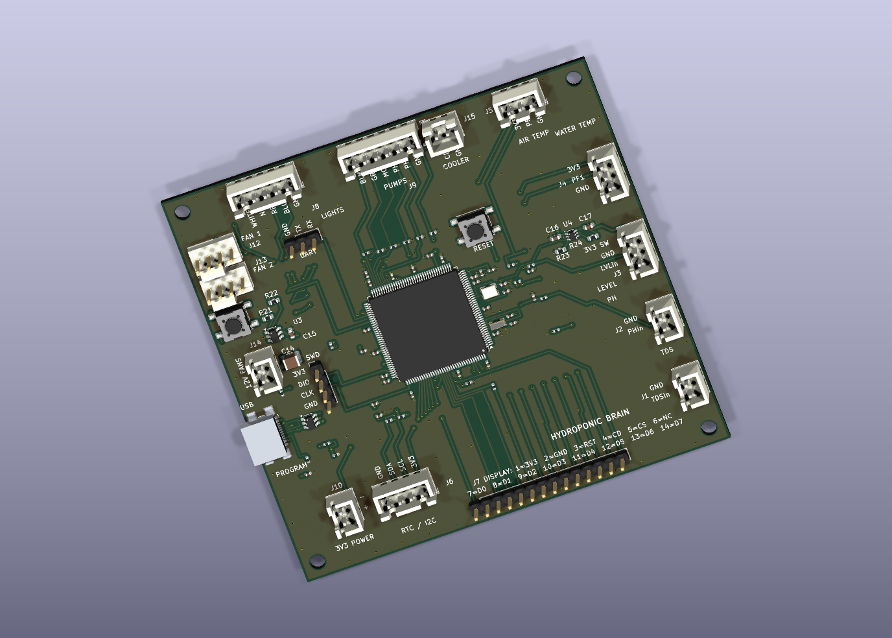
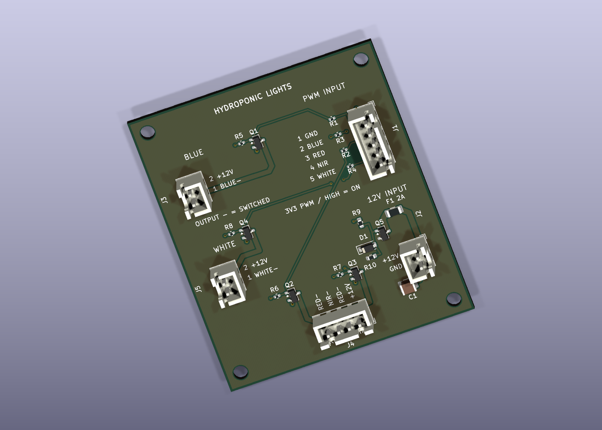
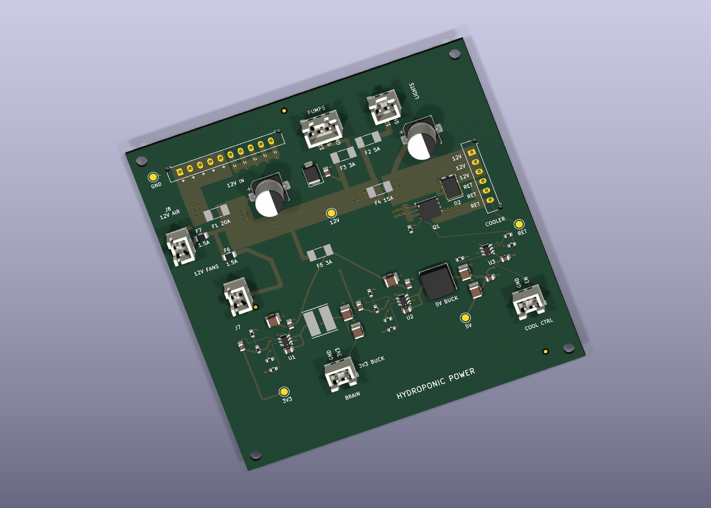
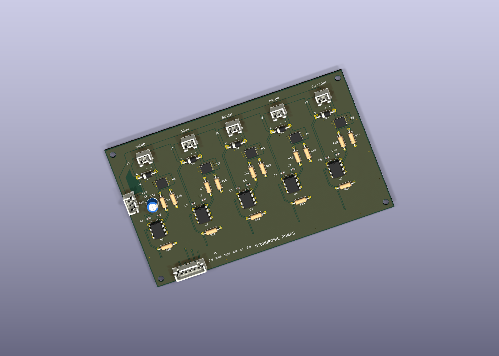

# Senior Design PCBs

Editable KiCad projects for the brain, light, power, and pump boards.

## Board previews

3D renders from the KiCad designs. Parts without available 3D models may not appear.

### Brain board

The main STM32 controller connects the environmental sensors and display, and provides control signals for the lights, dosing pumps, fans, and cooler.

### Light board

Four MOSFET channels switch the blue, red, near-infrared, and white grow lights using PWM signals from the brain board.

### Power board

Distributes the 12 V supply through fused branches and generates 5 V and 3.3 V rails for the system. It also includes the cooler switching circuit.

### Pump board

Five MOSFET driver channels control the Micro, Grow, Bloom, pH-up, and pH-down dosing pumps, with flyback diodes for the pump loads.

## Open the designs

1. Install KiCad 10.0.3 or newer with the standard symbol, footprint, and 3D model libraries.
2. Clone this repository or download and extract the entire ZIP, keeping the folder structure intact.
3. In KiCad, open the project you want:
   - `brain_PCB/brain_PCB.kicad_pro`
   - `light_PCB/light_PCB.kicad_pro`
   - `power_PCB/power_PCB.kicad_pro`
   - `pump_PCB/pump_PCB.kicad_pro`
4. Open its schematic or PCB from the KiCad project manager.

Custom symbols, footprints, library tables, design rules, and the referenced local USB 3D model are included. Local libraries use `${KIPRJMOD}` paths so they work wherever you extract the repository. The USB model is a simplified representation.

Manufacturing outputs, review reports, backups, and personal editor settings are excluded. Generate fabrication files from the projects when needed.

Some power-board 3D models (the 6-pin and 10-pin Molex Micro-Fit connectors and Littelfuse NANO2 fuse) were unavailable in the KiCad 10.0.3 libraries used for verification. Their schematic symbols and PCB footprints are included in the designs; these parts may be absent from the 3D view.
